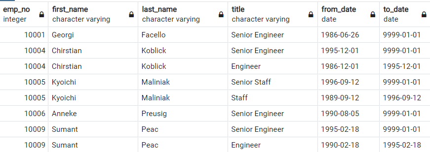
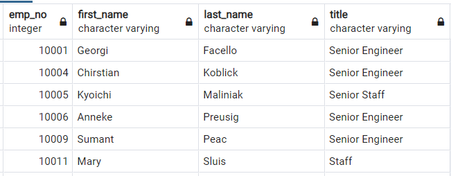
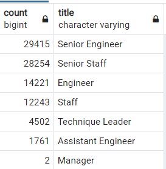
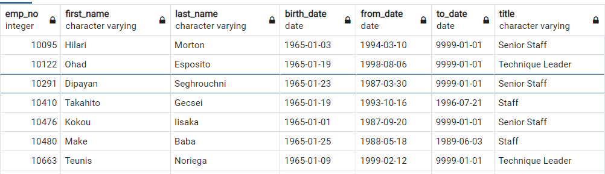
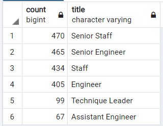

# Pewlett-Hackard-Analysis
# Overview
We want to determine the number of retiring employees per title, and identify employees who are eligible to participate in a mentorship program. The analysis helps Bobby?s manager for the ?silver tsunami? as many current employees reach retirement age.

# Results
1- We first create a list of employees and their titles that will be retiring soon
	We assume that the employees who retire soon are born between years 1952 to 1955
    We save this list as retirement_titles
	

2- We then create a list without duplicates from the retirement_titles
	We call this list unique_titles
    

3- Using the unique_titles, we prepare a count of each titles for the retiring employees
	We call this list retiring_titles
    

4- Finally we create a list of employees eligible for the mentorship program
	These are the ones who were born in 1965. We call this list mentorship_eligibility
    
    

# Summary

As we see from the figure of retiring_titles, there are a number of positions that need to be filled.  

We see that the number of eligible employees for mentorship is a fraction of retiring ones for each title

The good news is that there are enough retirement-ready employees to mentor the next generation, however, to fill the position for all the retiring employees an intense re-hiring campaign is needed.
